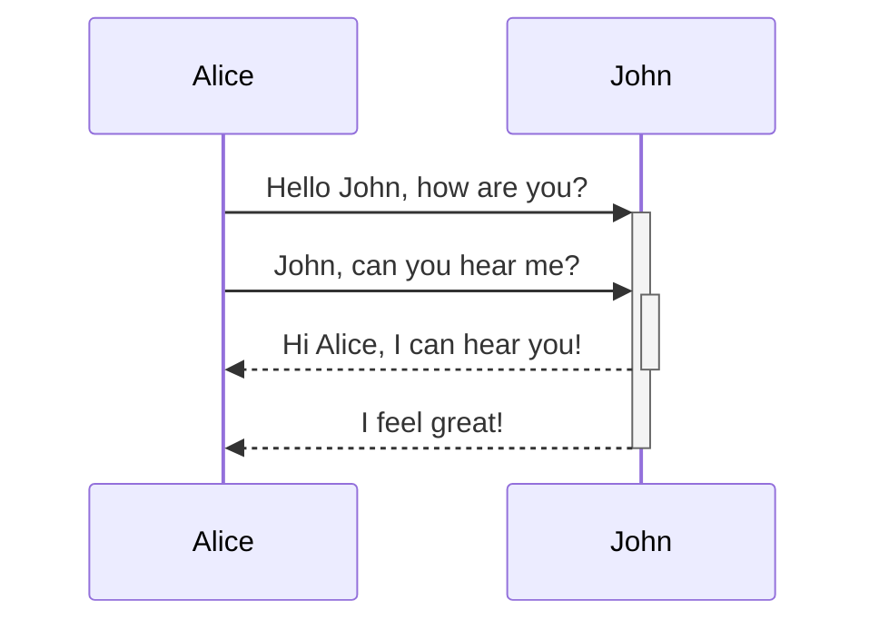
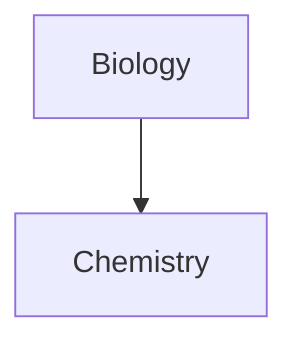

---
tags:
  - my_tag
aliases: 
cssclasses: 
checkbox: 
datetime:
---
# Tag

#it_is_tag #simple #inbox/processing 
# Text

**Bold**

*Italic*

==Highlight==

각주[^asdf] 

~~123aqsdasd~~

> Write Content or memo
# Link

link1 : [[Intro]]

link 2 : insert content
![[Intro#Hello gRPC]]

link 3 : annotation
[[Intro#^de5f63]]

link 3 : insert image & resize


# Image

![[lofi.png|300]]

![[BlackImage.webp|200x200]]

# callout

> [!note]
> Lorem ipsum dolor sit amet

> [!tip] Callouts can have custom titles 
> Like this one.

> [!tip] Title-only callout

> [!success]
> Lorem ipsum dolor sit amet

> [!todo]
> Lorem ipsum dolor sit amet

> [!info] 
> Here's a callout block. 
> It supports **Markdown**, [[Internal link|Wikilinks]], and [[Embed files|embeds]]! 
> ![[og-image.png]]

> [!question] Can callouts be nested? 
> > [!todo] Yes!, they can. 
> > > [!example] You can even use multiple layers of nesting.

> [!bug] 
> Lorem ipsum dolor sit amet

> [!example] 
> Lorem ipsum dolor sit amet
> ```rust
> println!("hello");
> ```

> [!warning]
> Lorem ipsum dolor sit amet

> [!danger] 
> Lorem ipsum dolor sit amet

> [!quote] 
> Lorem ipsum dolor sit amet

> [!abstract]
> Lorem ipsum dolor sit amet


# Tables

| First name | Last name |
| ---------- | --------- |
| Max        | Planck    |
| Marie      | Curie     |


First column | Second column
-- | --
[[Basic formatting syntax\|Markdown syntax]] | ![[og-image.png\|200]]


Left-aligned text | Center-aligned text | Right-aligned text
:-- | :--: | --:
Content | Content | Content

# mermaid diagram






# Math

$$
\begin{vmatrix}a & b\\
c & d
\end{vmatrix}=ad-bc
$$


This is an inline math expression $e^{2i\pi} = 1$.


---
[^asdf]: this is 각주